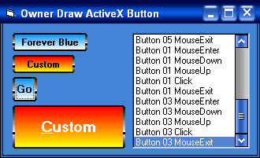



## ForeverBlue Button Control

### Description

Update 09 Feb 2003. A simple but nice looking owner draw resizable button control. Custom border and gradient colors allowed. No themes required. Works in 98/2000/Xp. Chm doc file included.
 
### More Info
 

             |
---                |---
**Submitted On**   |2003-02-07 18:15:32
**By**             |[Dana Seaman\_](https://github.com/Planet-Source-Code/PSCIndex/blob/master/ByAuthor/dana-seaman.md)
**Level**          |Intermediate
**User Rating**    |4.3 (17 globes from 4 users)
**Compatibility**  |VB 6\.0
**Category**       |[Custom Controls/ Forms/  Menus](https://github.com/Planet-Source-Code/PSCIndex/blob/master/ByCategory/custom-controls-forms-menus__1-4.md)
**World**          |[Visual Basic](https://github.com/Planet-Source-Code/PSCIndex/blob/master/ByWorld/visual-basic.md)
**Archive File**   |[ForeverBlu154172292003\.zip](https://github.com/Planet-Source-Code/dana-seaman-foreverblue-button-control__1-43025/archive/master.zip)

